# Cobrar con la terminal Fiserv desde Odoo

**Guía de usuario.** Para quien configura y usa la integración desde Contabilidad. No hace falta
saber nada de programación.

> Las capturas son de una base de prueba, con Odoo en inglés y una terminal simulada. En una base
> en español los botones dicen lo mismo traducido («Confirm» = «Confirmar», «Draft» = «Borrador»).

---

## 1 · Qué es esto

Odoo le habla a la **terminal de tarjetas Fiserv** (el pinpad) a través del servicio **ITD** de
Fiserv. En vez de cobrar en el pinpad por un lado y anotar el pago en Odoo por otro, se hace una
sola vez: Odoo le manda el importe a la terminal, el cliente pasa la tarjeta, y cuando la terminal
aprueba, el pago queda con su **número de ticket, lote y autorización**.

Lo que se gana es que **no hay dos versiones de la verdad**: el ticket del voucher es el mismo que
está en Odoo, así que cuando llega la liquidación cada movimiento tiene su pago.

**Lo que hace:**

- cobra con tarjeta, con o sin factura;
- devuelve plata a una tarjeta contra el ticket original (anulación o devolución, Odoo elige);
- guarda ticket, lote, autorización, tarjeta (últimos 4) y emisor de cada operación;
- imprime el voucher desde la transacción.

**Lo que no hace:** el cierre de lote (se hace en el pinpad, como siempre) y no cobra desde el
punto de venta de Odoo (ver §9).

---

## 2 · Configuración, una vez

La hace **un administrador** (con acceso a Ajustes). El contador que cobra no necesita tocar nada de
esto, y tampoco puede.

### 2.1 · Qué hay que pedirle a Fiserv

| dato | qué es |
|---|---|
| **URL ITD** | la dirección del servicio. Una para pruebas y otra para producción |
| **SystemId** | el identificador del comercio ante ITD. **Es un dato sensible**: no se manda por chat ni se pega en tickets |
| **Branch** y **ClientAppId** | sucursal y caja, si Fiserv los asignó (ClientAppId suele ser `1`) |
| **PosID** de cada pinpad | el número de terminal, uno por pinpad |

### 2.2 · El proveedor de pago

**No hay que crearlo.** Al instalar la integración aparece solo en **Contabilidad > Configuración >
Proveedores de pago**, con el nombre *Fiserv ITD*, **deshabilitado y sin datos**. Nace apagado a
propósito: un medio de cobro habilitado sin datos parece disponible y no cobra.

En la pestaña **Credentials**: URL ITD, SystemId (queda oculto con puntos), Branch y ClientAppId.
Después, **Estado: Habilitado**.

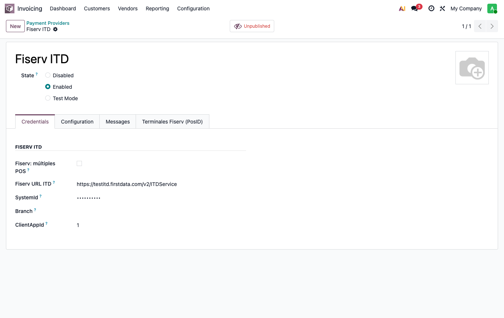

### 2.3 · El diario

Conviene un **diario bancario propio**, por ejemplo *Fiserv ITD* (código `FSVR`): así los cobros con
tarjeta no se mezclan con el banco. Se crea como cualquier diario bancario y se elige en la pestaña
**Configuration** del proveedor, campo **Payment Journal**.

Al guardarlo, Odoo crea en ese diario **dos métodos de pago Fiserv**: uno para cobrar y otro para
devolver. No hay que agregarlos a mano.

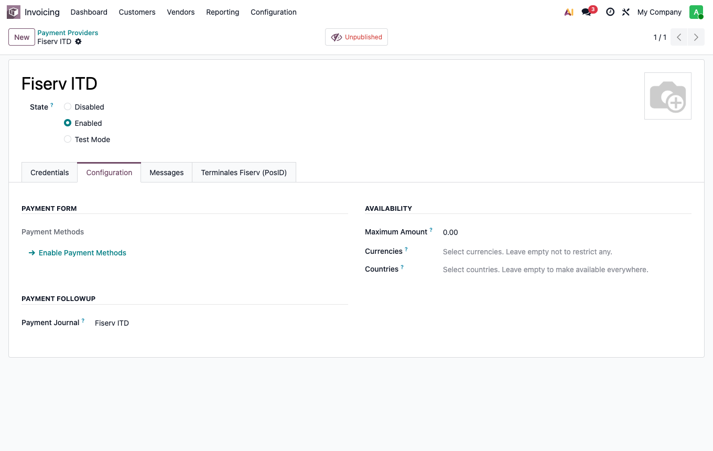

> Si no se elige diario, Odoo usa el primer diario bancario de la compañía. Funciona, pero los
> cobros con tarjeta van a quedar mezclados con ese banco.

### 2.4 · La terminal

En la pestaña **Terminales Fiserv (PosID)** del proveedor, una línea por pinpad: un nombre que se
entienda («Caja 1») y su PosID. Con **más de un pinpad**, marcar además *Fiserv: múltiples POS* en
Credentials: así el pago obliga a elegir en cuál cobrar.

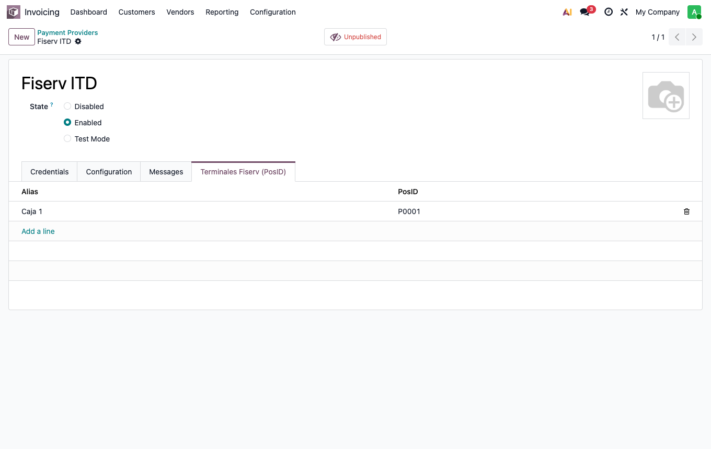

### 2.5 · Con varias empresas en la misma base

El proveedor se crea en la empresa que estaba activa al instalar. Las empresas que se creen
**después** reciben su propio proveedor, apagado. Las que **ya existían** no: a esas se lo duplica
un administrador (Acción > Duplicar, cambiando la empresa) y se configura igual.

---

## 3 · Antes de empezar a cobrar cada día

**Tiene que estar cargada la cotización del dólar del día.** Con la localización uruguaya, Odoo no
confirma un pago —ni en pesos— si falta (comprobado al validar la integración Getnet, sobre la misma
localización), y el mensaje habla de tipo de cambio, no de Fiserv. El
cobro en el pinpad sale bien y lo que falla es el paso siguiente, «Confirmar». En producción la
cotización se carga sola cada mañana; si el mensaje aparece, avisá a soporte.

---

## 4 · Cobrar

### 4.1 · Con factura (el caso completo)

1. Abrí la factura y pulsá **Pagar**. Con Fiserv habilitado, este botón abre el **pago** con la
   factura ya cargada (importe, cliente, referencia).

   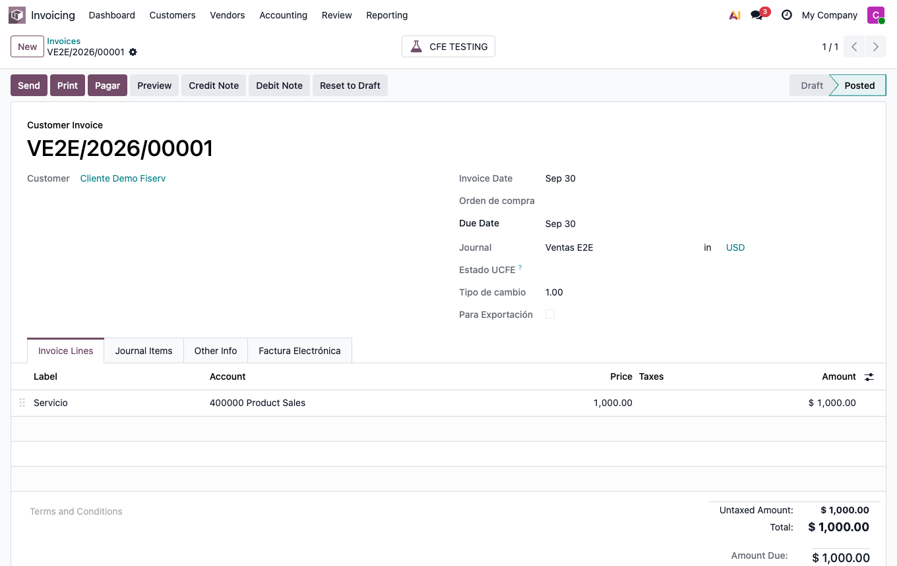

2. En el pago elegí el **diario Fiserv ITD** y el método **Fiserv ITD**. Se marca solo *Cobrar en
   terminal Fiserv* y, si hay una sola terminal, se elige sola. Guardá.

   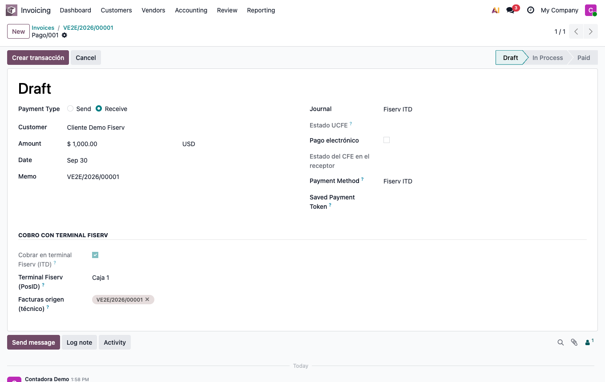

3. Pulsá **Crear transacción**. Odoo le manda el importe al pinpad y muestra *Procesando en la
   terminal Fiserv…*. El cliente pasa la tarjeta.

   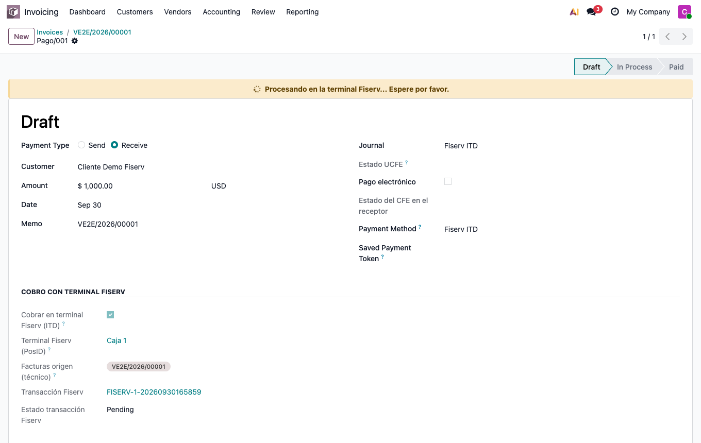

4. Cuando la terminal aprueba, **la pantalla se actualiza sola** y aparece *Transacción Fiserv
   aprobada*. En el historial queda el ticket, el lote y la autorización.

   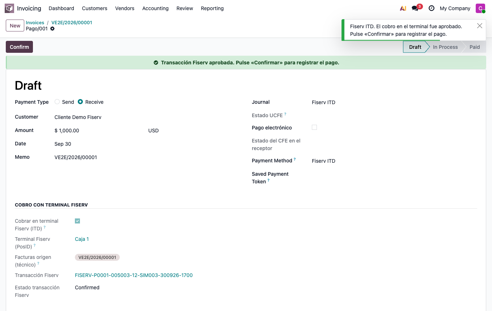

5. Pulsá **Confirmar**. El pago se registra y la factura queda **pagada**.

   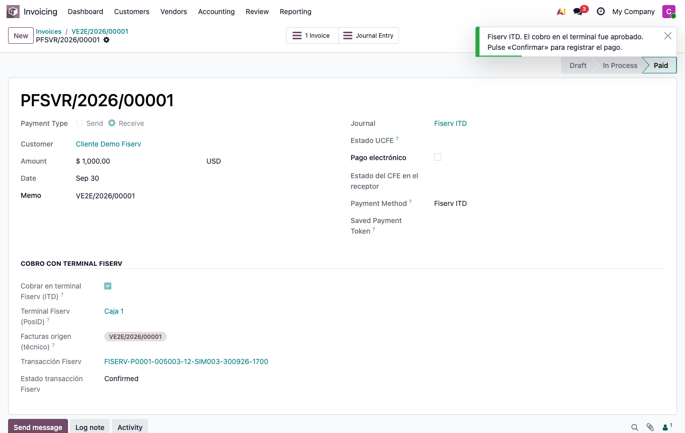

**Importante:** el pago **nunca se confirma solo**. Hasta que no pulsás *Confirmar*, la plata está
cobrada en la tarjeta pero no registrada en la contabilidad. Y *Confirmar* no aparece hasta que la
terminal aprobó: no se puede registrar un cobro con tarjeta que no pasó por el pinpad.

### 4.2 · Sin factura, o varias facturas juntas

Desde **Contabilidad > Clientes > Pagos > Nuevo**: cliente, importe, diario Fiserv, método Fiserv. Si
corresponde a facturas, cargalas en **Facturas origen**: al confirmar, el pago se concilia con ellas.
Sin facturas, el cobro sale igual y la conciliación se hace después, como con cualquier pago.

Desde la lista de facturas también se pueden elegir varias del mismo cliente y usar **Acción >
Registrar pago (con terminal)**.

### 4.3 · El asistente «Registrar pago» no sirve para Fiserv

Si alguien llega al asistente clásico con el método Fiserv, Odoo avisa y no deja seguir: ese
asistente confirma el pago en el acto, sin pasar por el pinpad. El camino es **Pagar** (§4.1).

---

## 5 · Devolver plata a una tarjeta

1. **Contabilidad > Clientes > Pagos > Nuevo**, tipo **Enviar dinero** (*Send*).
2. Cliente, diario **Fiserv ITD**, método **Fiserv ITD**.
3. En **Transacción original (devolución)** elegí el cobro a devolver. El importe, el cliente y la
   moneda se completan solos y **no se pueden cambiar**: la devolución es por el total del cobro.
4. Guardá y pulsá **Crear transacción**. Cuando la terminal aprueba, **Confirmar**.

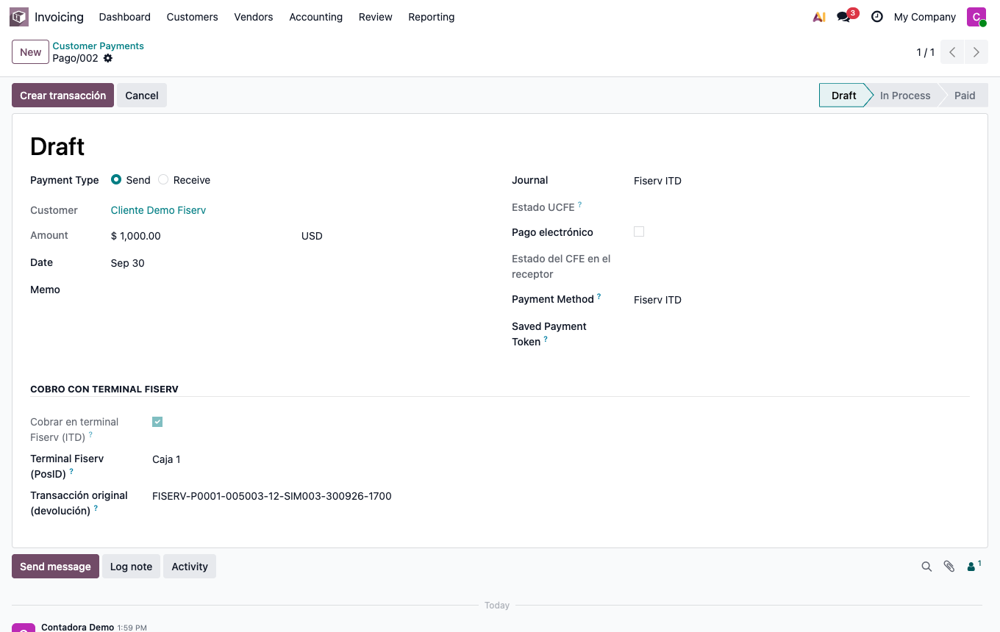

Odoo decide solo si es una **anulación** (la venta todavía está en el lote abierto del pinpad) o una
**devolución** (el lote ya se cerró). No hay que elegirlo.

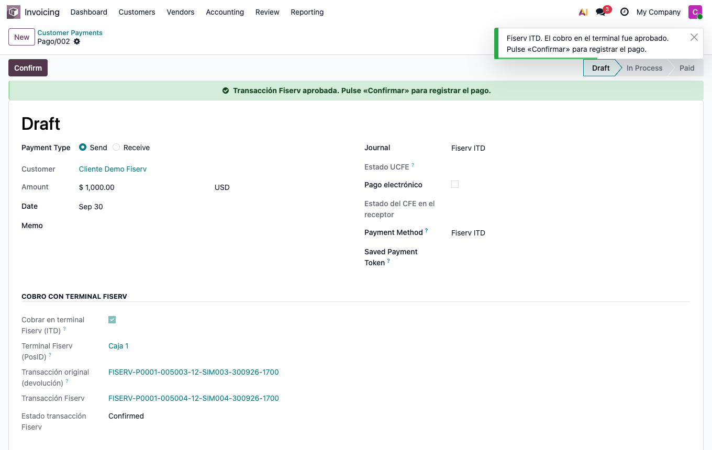

---

## 6 · Qué significa cada estado

El estado de la **transacción** se ve en el pago, en *Estado transacción Fiserv*.

| en la pantalla | qué pasó | qué hacer |
|---|---|---|
| sin transacción | todavía no se le pidió nada a la terminal | «Crear transacción» |
| **Procesando…** (aviso amarillo) | la terminal está esperando la tarjeta | esperar |
| **Confirmada** (aviso verde) | **la plata está** | «Confirmar» |
| **Error** | la terminal o Fiserv dijeron que **no** (fondos, tarjeta, datos) | cobrar de nuevo u otro medio |
| **Pendiente** (aviso rojo) | **no se sabe** si se cobró | **no repetir**: ver §7.2 |
| **Cancelada** | se verificó que no hubo cobro | cobrar de nuevo |

La diferencia que más importa es **Error** contra **Pendiente**. *Error* es la terminal diciendo
que no pasó nada. *Pendiente* es no saber, y puede haber plata cobrada.

---

## 7 · Cuando algo sale mal

### 7.1 · «La terminal rechazó» / «ITD rechazó el inicio»

Es una respuesta, no una falla: fondos, tarjeta, límite, o un dato de configuración mal cargado. El
motivo sale en el mensaje y en la transacción. **El pago queda como estaba**: se cobra con otra
tarjeta o por otro medio. Si el mensaje habla de pinpad, sucursal, caja o identificador de sistema
inválido, es configuración: avisá al administrador (§2).

### 7.2 · «No se pudo confirmar si la operación llegó a la terminal»

Aparece cuando **Fiserv no contestó** (se cortó internet, el servicio estaba caído, tardó
demasiado). No es un rechazo: **el pedido pudo haber llegado** y el pinpad pudo haber cobrado.

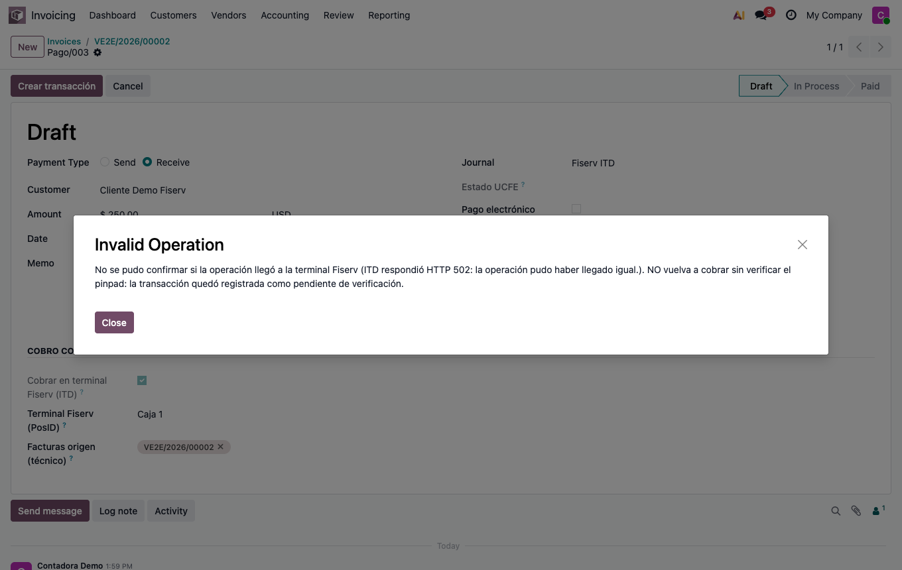

El pago queda con un aviso rojo, **sin** «Crear transacción» ni «Confirmar», para que nadie cobre dos
veces:

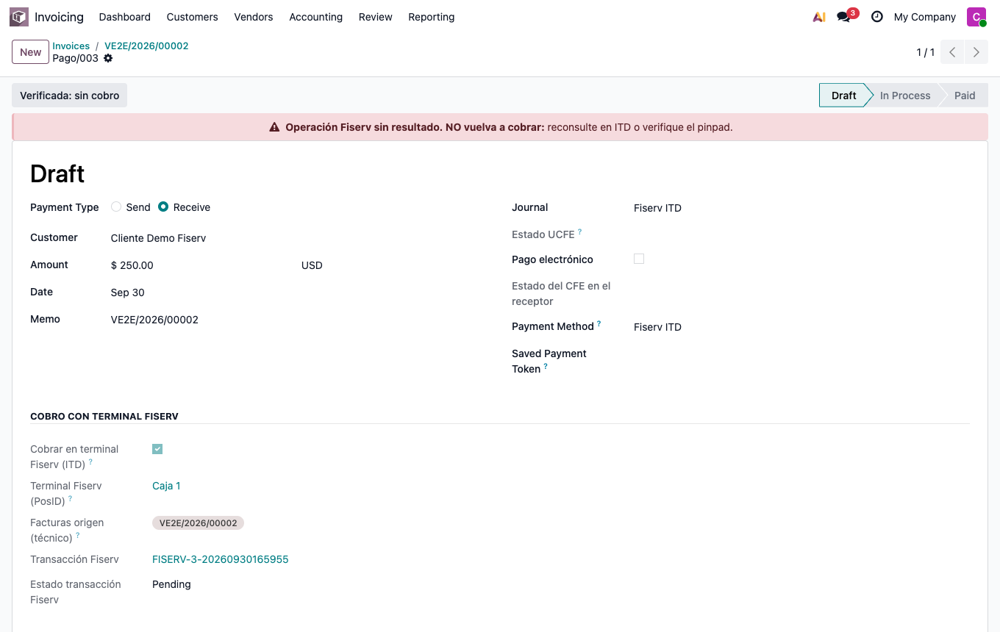

**Qué hacer:**

1. **Mirá el pinpad y el voucher.** ¿Salió un comprobante de aprobación por ese importe?
2. Si el pago muestra **Reconsultar en ITD**, pulsalo: Odoo le pregunta a Fiserv por esa operación.
   Si Fiserv responde, el pago queda aprobado o rechazado según corresponda. (El botón aparece sólo
   cuando Fiserv llegó a asignarle un número a la operación: si el corte fue antes, no hay a quién
   preguntarle y se sigue con el paso 3.)
3. Si verificaste que **no** se cobró (no hay voucher, no figura en el lote), pulsá **Verificada: sin
   cobro**. La transacción queda cancelada y el pago vuelve a permitir «Crear transacción».
4. Si **sí** se cobró pero Odoo no lo sabe, **no** marques «sin cobro»: avisá a soporte con el
   número de ticket del voucher.

«Verificada: sin cobro» lo puede usar un usuario de Contabilidad. Es una afirmación sobre plata: úsalo
sólo después de mirar el pinpad o el cierre de lote.

### 7.3 · La terminal está ocupada

Odoo **no reserva** la terminal: si dos personas mandan un cobro al mismo pinpad a la vez, el que
llega segundo recibe el rechazo de la propia terminal o de Fiserv, con su mensaje. Esperá a que
termine el otro cobro y volvé a intentar. En la práctica: **una terminal por caja**.

### 7.4 · Se cerró el navegador o se reinició Odoo en medio de un cobro

La transacción quedó registrada **antes** de mandar el cobro, así que no se pierde. Al volver a abrir
el pago verás el aviso rojo de §7.2: **Reconsultar en ITD** resuelve el caso. Si justo quedó
«Procesando…» y no avanza, esperá unos minutos: la consulta automática dura como mucho 15 minutos;
pasado ese tiempo, «Reconsultar» vuelve a estar disponible.

### 7.5 · Dónde ver todas las operaciones

**Contabilidad > Clientes > Transacciones Fiserv**: todos los cobros y
devoluciones, con ticket, últimos 4 dígitos y estado. El filtro **Fiserv: requieren verificación**
muestra las que Odoo no pudo resolver solo. Esa lista vacía al cierre del día es la señal de que
todo cerró.

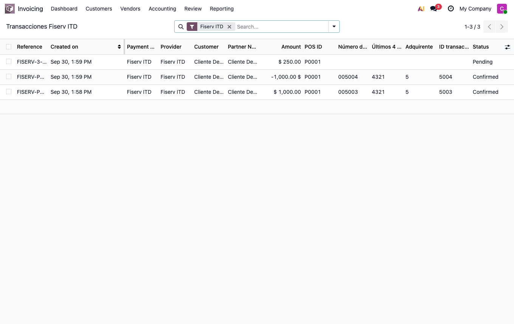

### 7.6 · Cuándo llamar a soporte

- un pago en **Pendiente** que «Reconsultar» no resuelve y no podés verificar en el pinpad;
- un cobro que figura en el voucher o en el lote y no en Odoo (o al revés);
- el mismo rechazo de configuración más de una vez;
- varias operaciones por verificar en el mismo día: eso es algo fallando, no mala suerte.

---

## 8 · El voucher

Desde la transacción (o desde la lista de Transacciones Fiserv): **Imprimir > Voucher Fiserv POS**.

---

## 9 · Limitaciones conocidas

Están acá para que nadie las descubra con un cliente enfrente:

1. **El camino es Contabilidad > Pagos** (o «Pagar» en la factura). El asistente «Registrar pago»
   no sirve para Fiserv (§4.3).
2. **La devolución es por el total** del cobro original. No hay devolución parcial desde Odoo.
3. **El cierre de lote se hace en el pinpad.** Odoo no lo registra.
4. **No hay reserva de terminal** (§7.3): una terminal por caja.
5. **No funciona desde el punto de venta de Odoo** (el TPV). Quedó fuera a propósito; se retoma si un
   cliente lo pide.
6. **La verificación de pendientes es manual** («Reconsultar en ITD» / «Verificada: sin cobro»).
   Odoo no vuelve a preguntar solo más tarde.
7. **Hace falta la cotización del dólar del día** para confirmar pagos (§3).
8. Esta versión fue validada contra una terminal **simulada**. La primera puesta en marcha real se
   hace con Fiserv en ambiente de pruebas antes de cobrar a clientes.

---

## 10 · Resumen de una hoja

**Cobrar:** Factura → **Pagar** → diario y método *Fiserv ITD* → Guardar → **Crear transacción** →
tarjeta → aviso verde → **Confirmar**.

**Devolver:** Pagos → Nuevo → *Enviar dinero* → diario y método Fiserv → *Transacción original* →
**Crear transacción** → **Confirmar**.

**Si queda en Pendiente (aviso rojo):** no repitas. Mirá el pinpad → **Reconsultar en ITD** → si no
hubo cobro, **Verificada: sin cobro**.

**Al cerrar el día:** Transacciones Fiserv, filtro *requieren verificación*, vacío.
