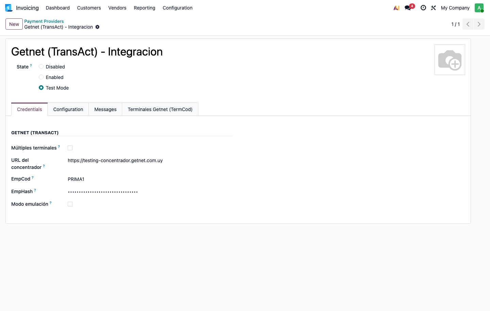
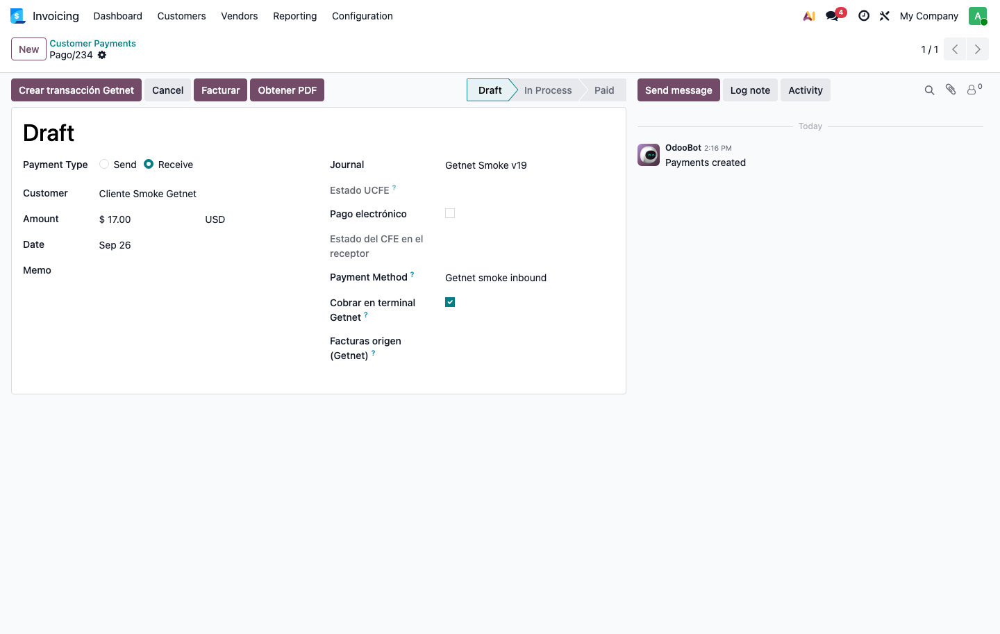

# Cobrar con la terminal Getnet desde Odoo

**Guía de usuario.** Para quien configura y usa la integración desde Contabilidad. No hace falta
saber nada de programación.

---

## 1 · Qué es esto

Odoo le habla a la **terminal de tarjetas Getnet** (el pinpad). En vez de cobrar en el pinpad por
un lado y anotar el pago en Odoo por otro, se hace una sola vez: Odoo le pide el importe a la
terminal, la clienta pasa la tarjeta, y cuando la terminal aprueba el pago queda registrado con su
**número de ticket, lote y autorización**.

Lo que se gana no es velocidad, es que **no hay dos versiones de la verdad**. El número de ticket
del voucher es el mismo que está en Odoo, así que cuando llega la liquidación del adquirente cada
movimiento tiene su pago.

**Lo que hace:**

- cobra un pago con tarjeta, con o sin factura;
- devuelve plata a una tarjeta (una devolución contra el ticket original);
- guarda el ticket, el lote, la autorización y el voucher de cada operación;
- cierra el lote del día contra el adquirente.

**Lo que NO hace, hoy:**

- no se cobra desde la factura (se cobra desde **Contabilidad > Pagos**);
- no se cobra desde el punto de venta de Odoo;
- la pantalla **no se actualiza sola**: hay que refrescar. Ver §4.3, está explicado.

---

## 2 · Configuración, una vez

Esto lo hace quien implanta, pero conviene que lo entienda quien lo va a usar: si algo falla, casi
siempre es uno de estos cuatro.

### 2.1 · Qué hay que pedirle a New Age Data

New Age Data es quien opera el concentrador de Getnet. **Tres datos**, y son distintos en pruebas y
en producción:

| dato | para qué sirve |
|---|---|
| **EmpCod** | identifica al comercio |
| **EmpHASH** | es la contraseña del comercio. No se comparte por chat ni se anota en un archivo cualquiera |
| **TermCod** | identifica el pinpad. Uno por terminal física |

Si tenés varias cajas con pinpad, pedí **un TermCod por cada una**.

### 2.2 · El proveedor de pago

En **Contabilidad > Configuración > Proveedores de pago**, el proveedor **Getnet**:

- **Estado**: *Test* mientras se prueba, *Habilitado* cuando se opera de verdad.
  ⚠️ Nace en *Deshabilitado*, y así **no cobra**. Es el olvido más común.
- **URL del webservice**: la que corresponda al ambiente.
- **EmpCod** y **EmpHASH**: los de New Age Data.

La contraseña del comercio **no se ve** desde un usuario de Contabilidad, y está bien que sea así.
En la ficha aparece siempre enmascarada:

### 2.3 · El diario

Getnet cobra en su **propio diario de banco**, nunca en uno de caja.

El motivo es práctico: el adquirente no deposita la plata en el momento. La acredita días después,
menos la comisión, y junta varias ventas en un solo depósito. Si las tarjetas fueran a un diario de
caja, el arqueo contaría plata que no está en el cajón y la conciliación del banco nunca
encontraría el movimiento. Con un diario propio, su saldo es exactamente **lo que el adquirente
todavía nos debe**.

### 2.4 · La terminal

En el menú de Getnet, **Terminales**: una por pinpad, con su **TermCod**.

Si hay más de una, al cobrar Odoo va a pedir **cuál**. Con una sola la elige él.

---

## 3 · Antes de empezar a cobrar cada día

Una sola cosa, y si falta se nota tarde:

> **Tiene que estar cargada la cotización del dólar del día.**

Suena ajeno a las tarjetas, y lo es. Pero Odoo no confirma **ningún** pago —ni en pesos— si falta la
cotización del día, y el mensaje que sale habla de tipo de cambio, no de Getnet. Lo peor del caso es
el orden: **el cobro en el pinpad sale bien** y lo que falla es el paso siguiente, cuando ya le
cobraste a la clienta.

En producción eso lo carga Odoo solo todas las mañanas. Si el mensaje aparece, avisá a soporte: no
lo resuelvas apagando nada.

---

## 4 · Cobrar

### 4.1 · Con factura (el caso completo)

1. **Contabilidad > Pagos > Nuevo.**
2. Elegí el **cliente**, el **importe** y el **diario Getnet**.
   Al elegir el diario, «Cobrar en terminal Getnet» se marca solo.
3. En **«Facturas origen (Getnet)»**, cargá la factura que se está cobrando.
   **Esto importa de verdad:** con **una** factura, Odoo le manda a la terminal el número de la
   factura y sus montos de IVA. Es lo que alimenta la **devolución de IVA de la ley 19210** para el
   consumidor final. Sin factura, ese dato no viaja.
4. **«Crear transacción Getnet»**.

   Mirá el encabezado de esa pantalla: **no hay botón «Confirmar»**. No es que falte — está oculto
   a propósito mientras la terminal no haya aprobado. Aparece recién cuando el cobro está hecho.
   Es la misma idea que el candado del cajón: no se puede registrar plata que todavía no entró.

5. La terminal le pide la tarjeta y el PIN a la clienta.
6. Cuando aprueba, el pago queda **en borrador** con un aviso verde: *«Cobro aprobado en la terminal
   Getnet…»* con el ticket, el lote y la autorización.
7. **«Confirmar»** → el pago se registra y **se concilia con la factura**, que queda pagada.

> **Por qué no se confirma solo:** porque confirmar es un acto contable y lo decide una persona. La
> terminal dice que la plata está; registrarla es otra cosa.

### 4.2 · Sin factura, o cobrando varias juntas

Igual, salteando el paso 3 (o cargando varias facturas).

Odoo le manda a la terminal «factura número 0», que es lo que corresponde cuando no hay **una**
factura única. El cobro funciona igual. Lo que no viaja son los montos de IVA del paso 3.

Al Confirmar, si cargaste varias facturas, Odoo concilia lo que puede. Si alguna no se puede
emparejar, **el pago se confirma igual** y queda un aviso en el pago diciendo con cuál no pudo. Es a
propósito: la plata ya está cobrada y emparejarla es una tarea administrativa, no un motivo para
trabar el cobro.

### 4.3 · El refresco es manual (no es que esté colgado)

Mientras se espera la terminal, la pantalla dice **«Esperando respuesta de la terminal Getnet…»**.

> ⚠️ **Ese mensaje no se va solo.** Aunque la terminal haya aprobado en menos de un segundo, la
> pantalla sigue igual hasta que **refresques** (F5, o volver a abrir el pago).

Lo escribimos sin vueltas porque es lo que más se confunde con «el sistema está lento». No lo está:
el dato ya está guardado. Falta que la pantalla lo vaya a buscar. Está en la lista de mejoras.

**Qué hacer:** esperá a que la clienta vea «aprobado» en el pinpad, refrescá, y seguí.

---

## 5 · Devolver plata a una tarjeta

Se hace con un **pago saliente** contra la transacción original.

1. **Contabilidad > Pagos > Nuevo**, tipo **Enviar dinero**, diario Getnet.
2. En **«Transacción original (devolución)»** elegí la transacción aprobada que se devuelve.
   Odoo completa solo el importe, la moneda y el cliente.
3. **«Crear transacción Getnet»** → la terminal procesa la devolución contra el **ticket original**.

Cosas a tener claras:

- La devolución **no borra ni modifica** el cobro original. Queda como un movimiento aparte, porque
  esa transacción existió. En el resumen de la clienta van a aparecer las dos líneas.
- Se devuelve **en la misma moneda** que el cobro original.
- Si la devolución **no queda confirmada**, Odoo **no la reintenta solo**. Es deliberado: reintentar
  a ciegas puede devolver dos veces. Queda registrada y hay que verificarla antes de volver a
  intentar. Si te pasa, avisá a soporte.

---

## 6 · Qué significa cada estado

| en la pantalla | qué pasó | qué hacer |
|---|---|---|
| **Borrador** (sin transacción) | todavía no se le pidió nada a la terminal | «Crear transacción Getnet» |
| **Esperando respuesta de la terminal** | se le pidió y no contestó todavía | esperar el pinpad y **refrescar** |
| **Aprobada / Hecho** | **la plata está** | «Confirmar» |
| **Error** | la terminal dijo que **no** (sin fondos, tarjeta mal) | cobrar de nuevo o por otro medio |
| **Cancelada** | no se llegó a cobrar (se canceló, tarjeta vencida) | cobrar de nuevo |
| **Pendiente** | **no se sabe** si se cobró | no repetir a ciegas: ver §7.4 |

La diferencia entre **Error** y **Pendiente** es la que más importa. *Error* es la terminal diciendo
que no pasó nada: no hay nada que buscar. *Pendiente* es no saber, y puede haber plata cobrada.

---

## 7 · Cuando algo sale mal

### 7.1 · «La terminal rechazó el pago»

Es un rechazo normal, no una falla del sistema: fondos, tarjeta, límite. El motivo que dio la
terminal sale en el mensaje. **El pago queda como estaba**, con su importe: se cobra con otra
tarjeta o en efectivo, sin volver a cargar nada.

### 7.2 · «La terminal está ocupada por otra operación»

Dos cobros no pueden usar el mismo pinpad a la vez. Esperá a que termine el otro.

Si nadie está cobrando y el mensaje sigue, quedó una operación trabada: **avisá a soporte**. Hay una
acción de administrador para liberarla, y **no conviene usarla a ciegas** — si había un cobro de
verdad en curso, liberar la terminal puede dejar plata cobrada en el pinpad sin pago en Odoo.

### 7.3 · La terminal no contesta / se cortó la luz / se cerró el navegador

El pago queda en **Pendiente**. **No vuelvas a cobrar sin verificar**: puede ser que la terminal
haya aprobado y no nos hayamos enterado.

Odoo lo resuelve solo: cada pocos minutos vuelve a preguntarle a la terminal por las transacciones
sin resolver. Si aprobó, queda aprobada; si no, cancelada. **Refrescá el pago un rato después.**

### 7.4 · La bandeja «Getnet: requieren conciliación»

Es una lista, en el menú de Getnet, de las transacciones que **Odoo no pudo resolver solo**.

**Cuándo aparece algo ahí:** cuando Odoo preguntó varias veces y la terminal nunca dio una respuesta
definitiva. Odoo deja de insistir a propósito —seguir preguntando para siempre esconde el
problema— y la pone ahí para que la mire una persona.

**Qué tenés que hacer vos:**

1. **Buscar el ticket en el cierre del adquirente** o en el voucher de papel. Es la pregunta a
   responder: ¿esa plata se cobró o no?
2. Si **se cobró**: registrá el pago (o avisá a soporte para que la transacción quede aprobada) y
   después marcala **«Marcar como conciliada»**.
3. Si **no se cobró**: marcala igual como conciliada, dejando en el motivo que se verificó que no
   existía.

**Cuándo llamar a soporte:** si no encontrás el ticket en ningún lado, si el importe no coincide, o
si hay más de una transacción por el mismo cobro. Y **siempre** si la bandeja tiene más casos de los
que esperabas: eso quiere decir que algo está fallando seguido, no que hubo mala suerte.

> Una bandeja vacía al final del día es la señal de que todo cerró. Revisala como parte del cierre.

---

## 8 · Cierre de lote

El adquirente **no empieza a pagar hasta que se cierra el lote** del día. Es la operación de fin de
turno.

**Cuándo:** al terminar el día o el turno, cuando ya no se va a cobrar más con esa terminal.

**Si está bloqueado:** Odoo no cierra el lote mientras haya transacciones **sin resolver**, y no es
terquedad: cerrar el lote **cancela** las que quedaron pendientes de confirmación. Si alguna era un
cobro real, se pierde.

**Qué hacer:** resolver primero las pendientes (§7.3 y §7.4) y cerrar después.

**Qué significa forzar:** que se cierra igual, asumiendo que esas transacciones se pierden. Lo puede
hacer un supervisor, **queda registrado quién lo hizo y cuántas transacciones había**, y sale en el
reporte de cierre. Se fuerza cuando ya se verificó a mano qué pasó con cada una — no para salir del
paso.

---

## 9 · Limitaciones conocidas

Están acá para que nadie las descubra con un cliente enfrente:

1. **El camino soportado es Contabilidad > Pagos.** El botón «Registrar pago» de la factura **no
   sirve** para cobrar con Getnet: crea el pago ya confirmado y la integración lo rechaza. No es un
   error a reportar.
2. **No hay botón en la factura.** Está pedido; hoy se cobra desde el pago.
3. **La pantalla no se refresca sola** (§4.3).
4. **Hace falta la cotización del dólar del día** para poder confirmar cualquier pago (§3).
5. **No funciona desde el punto de venta de Odoo.** Quedó pendiente a propósito; se retoma si un
   cliente lo pide.
6. **Una terminal por caja.** Dos cobros simultáneos en el mismo pinpad no se pueden.

---

## 10 · Resumen de una hoja

**Cobrar:** Pagos > Nuevo → cliente, importe, diario Getnet → cargar la factura → *Crear
transacción Getnet* → tarjeta → **refrescar** → *Confirmar*.

**Devolver:** Pagos > Nuevo > Enviar dinero → diario Getnet → elegir la transacción original →
*Crear transacción Getnet*.

**Si dice Pendiente:** no repitas. Esperá, refrescá, y si queda, mirá la bandeja de conciliación.

**Al cerrar el día:** bandeja de conciliación vacía → cerrar lote.
