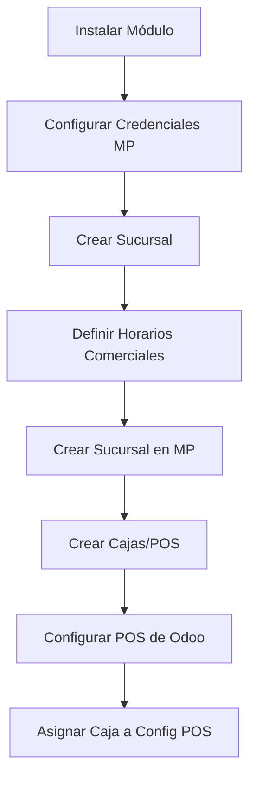
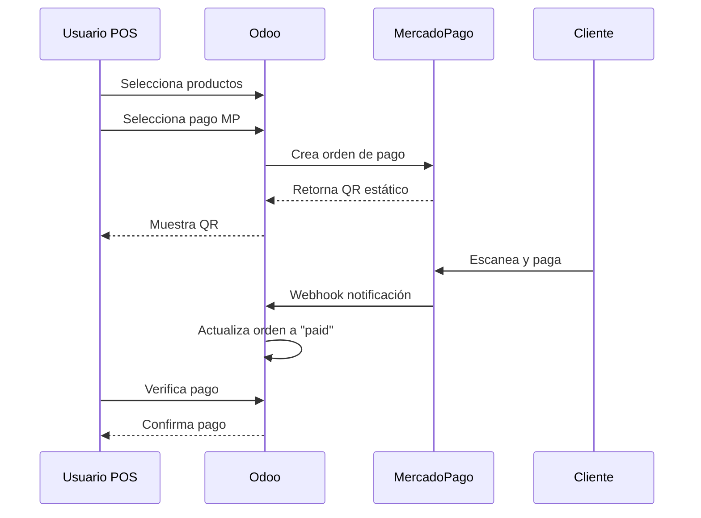
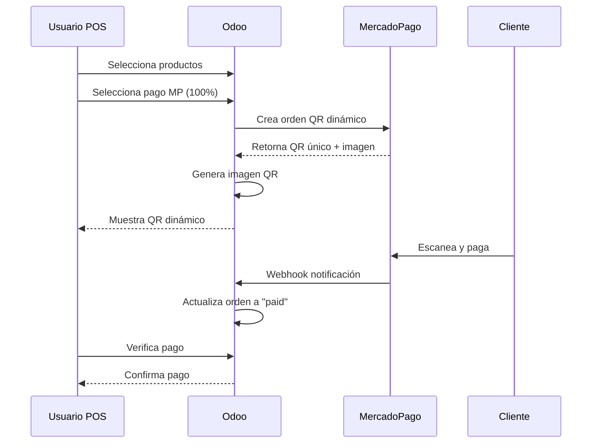

# POS MercadoPago QR Integration

## Descripción General

Módulo de integración de **MercadoPago** con el **Punto de Venta (POS)** de Odoo 17, que permite generar y procesar pagos mediante códigos QR estáticos y dinámicos. Este módulo extiende la funcionalidad base de `payment_mercado_pago` y `pos_mercado_pago` para ofrecer una solución completa de pagos QR en el POS.

---

## Características Principales

- ✅ **Generación automática de QR estáticos y dinámicos** para puntos de venta
- ✅ **Gestión de sucursales** (Store Branches) con integración a MercadoPago
- ✅ **Gestión de cajas** (Store Tills/POS) por sucursal
- ✅ **Webhooks** para notificaciones de pago en tiempo real
- ✅ **Validación de pagos** desde la interfaz del POS
- ✅ **Soporte para múltiples métodos de pago** en una misma orden
- ✅ **Configuración de horarios comerciales** por sucursal
- ✅ **Categorías de negocio** (Servicios, Gastronomía)

---

## Dependencias

```python
"depends": [
    "base",
    "payment_mercado_pago",
    "pos_mercado_pago"
]
```

> **Nota:** Este módulo requiere los módulos base de MercadoPago para Odoo.

---

## Arquitectura del Módulo

### Modelos Principales

#### 1. **`store.branches`** - Sucursales de Tienda

Gestiona las sucursales físicas que se registran en MercadoPago.

**Campos principales:**
- `name`: Nombre de la sucursal
- `external_id`: ID externo generado automáticamente (formato: `STORE{id}`)
- `mp_store_branch_id`: ID de la sucursal en MercadoPago
- `business_hours_ids`: Horarios comerciales (One2many)
- `store_tills_ids`: Cajas/POS de la sucursal (One2many)
- Campos de ubicación: `street_number`, `street_name`, `city_name`, `state_name`, `latitude`, `longitude`, `reference`

**Métodos clave:**
- `create_store_branch_mp()`: Crea la sucursal en MercadoPago vía API
- `generate_external_id()`: Genera el ID externo único
- `prepare_business_hours()`: Formatea los horarios para la API de MercadoPago
- `get_location()`: Retorna un diccionario con la información de ubicación

**Endpoint utilizado:**
```
POST https://api.mercadopago.com/users/{user_id}/stores
```

---

#### 2. **`store.tills`** - Cajas/Puntos de Venta

Representa las cajas individuales dentro de cada sucursal.

**Campos principales:**
- `name`: Nombre de la caja
- `store_branch_id`: Sucursal a la que pertenece (Many2one)
- `external_id`: ID externo generado automáticamente (formato: `{store_external_id}POS{id}`)
- `fixed_amount`: Indica si el QR tiene monto fijo
- `category`: Categoría del negocio (service/gastronomy)
- Campos de MercadoPago: `pos_id_mp`, `qr_url`, `qr_template_document`, `qr_template_image`, `qr_code`, `uuid_mp`, `user_id_mp`, `status_mp`

**Métodos clave:**
- `create_pos_mercado_pago()`: Crea el POS en MercadoPago al crear el registro
- `create_payment_order(order)`: Crea una orden de pago con QR estático
- `create_payment_order_qr(order)`: Crea una orden de pago con QR dinámico
- `get_category_code()`: Obtiene el código de categoría desde parámetros de configuración

**Endpoints utilizados:**
```
POST https://api.mercadopago.com/pos
POST https://api.mercadopago.com/mpmobile/instore/qr/{user_id}/{external_id}
POST https://api.mercadopago.com/instore/orders/qr/seller/collectors/{user_id}/pos/{external_id}/qrs
```

---

#### 3. **`business.hours`** - Horarios Comerciales

Define los horarios de operación de cada sucursal.

**Campos principales:**
- `day`: Día de la semana (Selection: sunday, monday, tuesday, etc.)
- `open_hour`: Hora de apertura (formato: `HH:MM`)
- `close_hour`: Hora de cierre (formato: `HH:MM`)
- `store_branch_id`: Sucursal asociada

**Validaciones:**
- Formato de hora estricto: `HH:MM` (ej: `09:00`, `18:30`)

---

#### 4. **`point.of.sales.mercado.pago`** - Configuración de POS MercadoPago

Modelo para almacenar información de puntos de venta de MercadoPago (legacy/alternativo).

**Campos principales:**
- `name`, `external_store_id`, `external_id`, `category`, `fixed_amount`
- `payment_method_id`: Método de pago asociado
- `pos_id`, `pos_qr_url`

---

#### 5. **`pos.payment.method`** (Herencia)

Extiende el modelo de métodos de pago del POS.

**Campos añadidos:**
- `qr_integration`: Boolean para indicar integración con QR

**Métodos:**
- `_find_terminal()`: Busca terminales MercadoPago registradas

---

### Controladores

#### **`MercadoPagoController`** (`controllers/main.py`)

Gestiona las comunicaciones entre Odoo y MercadoPago.

##### Rutas principales:

**1. `/pos/mercadopago/notifications` (Webhook)**
- **Tipo:** HTTP, autenticación pública
- **Propósito:** Recibe notificaciones de pago desde MercadoPago
- **Flujo:**
  1. Recibe notificación de tipo `payment` o `merchant_order`
  2. Obtiene información del pago/orden desde la API de MercadoPago
  3. Busca la orden en Odoo por `external_reference`
  4. Actualiza el estado de la orden a `paid`
  5. Retorna respuesta JSON

**2. `/pos/get_store_till/`**
- **Tipo:** JSON, autenticación de usuario
- **Propósito:** Obtiene información de una caja específica
- **Retorna:** Datos de la caja y tipo de QR configurado

**3. `/pos/create-order`**
- **Tipo:** JSON, autenticación de usuario
- **Propósito:** Crea una orden de venta en Odoo y genera el QR de pago
- **Flujo:**
  1. Procesa los items de la orden
  2. Calcula impuestos y totales
  3. Crea la orden en Odoo (`pos.order`)
  4. Genera la orden de pago en MercadoPago (QR estático o dinámico)
  5. Retorna datos de la orden y QR

**4. `/pos/delete-order`**
- **Tipo:** JSON, autenticación de usuario
- **Propósito:** Cancela una orden de pago
- **Flujo:**
  1. Cambia el estado de la orden a `cancel`
  2. Elimina la orden en MercadoPago vía API

##### Métodos auxiliares:

- `get_headers()`: Genera headers de autenticación para API de MercadoPago
- `get_payment_endpoint(payment_id)`: Consulta información de un pago
- `get_merchant_order_mp(merchant_order_id)`: Consulta una orden de pago
- `get_price_product()`: Calcula el precio del producto con impuestos
- `get_total_amount()`: Calcula el total de una orden

---

### Frontend (JavaScript)

#### **`PaymentMercadoPagoQR`** (`static/src/overrides/components/payment_screen/payment_screen.js`)

Extiende `PaymentMercadoPago` para integrar la funcionalidad de QR en la pantalla de pago del POS.

**Métodos principales:**

- `setup()`: Inicializa el componente y configura la caja
- `set_store_till()`: Obtiene la configuración de la caja desde el backend
- `send_payment_request(cid)`: 
  - Valida que en modo dinámico solo se use MercadoPago
  - Crea la orden en el backend
  - Muestra el QR en la interfaz (estático o dinámico)
  - Agrega botones de "Comprobar pago" y "Eliminar Orden"
- `get_paymentlines()`: Formatea las líneas de pago para el backend

**Flujo de pago:**
1. Usuario selecciona MercadoPago como método de pago
2. Se genera el QR (estático o dinámico según configuración)
3. Cliente escanea el QR y paga
4. Usuario hace clic en "Comprobar pago"
5. Sistema verifica el estado de la orden
6. Si está pagada, avanza a la pantalla de recibo

---

## Configuración

### Parámetros del Sistema (`ir.config_parameter`)

El módulo utiliza los siguientes parámetros de configuración:

| Parámetro | Descripción |
|-----------|-------------|
| `pos_mercadopago.user_id_mercado_pago` | ID de usuario de MercadoPago |
| `pos_mercadopago.access_token_mercado_pago` | Access Token de la API |
| `pos_mercadopago.public_key_mercado_pago` | Public Key |
| `pos_mercadopago.client_id_mercado_pago` | Client ID |
| `pos_mercadopago.client_secret_mercado_pago` | Client Secret |
| `pos_mercadopago.app_number_mercado_pago` | Número de aplicación |
| `pos_mercadopago.service_category_code_mercado_pago` | Código de categoría para servicios (default: 47300) |
| `pos_mercadopago.gastronomy_category_code_mercado_pago` | Código de categoría para gastronomía (default: 56101) |
| `pos_mercadopago.mp_qr_type` | Tipo de QR: `static` o `dynamic` |

### Grupos de Seguridad

- **Admin**: Acceso completo a todos los modelos
- **Branch Manager**: Acceso limitado a gestión de sucursales y cajas

---

## Flujo de Trabajo

### 1. Configuración Inicial



### 2. Proceso de Pago

#### QR Estático:


#### QR Dinámico:


---

## Diferencias: QR Estático vs Dinámico

| Característica | QR Estático | QR Dinámico |
|----------------|-------------|-------------|
| **QR Code** | Único por caja, reutilizable | Generado por orden, único |
| **Monto** | Definido en la orden | Definido en la orden |
| **Expiración** | No expira | 5 minutos desde creación |
| **Múltiples pagos** | ✅ Soportado | ❌ Solo 100% MercadoPago |
| **Endpoint** | `/mpmobile/instore/qr/...` | `/instore/orders/qr/seller/...` |
| **Imagen QR** | URL de MP | Generada con librería `qrcode` |

---

## Estructura de Archivos

```
pos_mercadopago/
├── __init__.py
├── __manifest__.py
├── controllers/
│   ├── __init__.py
│   └── main.py                    # Controladores HTTP/JSON
├── data/
│   └── ir_config_parameters.xml   # Parámetros de configuración
├── i18n/                          # Traducciones
├── models/
│   ├── __init__.py
│   ├── business_hours.py          # Horarios comerciales
│   ├── point_of_sale.py           # Herencia de POS
│   ├── pos_mercado_pago.py        # Modelo legacy de POS MP
│   ├── pos_payment_method.py      # Herencia de métodos de pago
│   ├── settings.py                # Configuraciones
│   ├── store_branches.py          # Sucursales
│   └── store_tills.py             # Cajas/POS
├── security/
│   ├── ir_groups.xml              # Grupos de seguridad
│   ├── ir.model.access.csv        # Permisos generales
│   ├── admin/
│   │   └── ir.model.access.csv    # Permisos admin
│   └── branch_manager/
│       └── ir.model.access.csv    # Permisos manager
├── static/
│   └── src/
│       ├── components/            # Componentes JS (popup, QR)
│       └── overrides/
│           └── components/
│               └── payment_screen/
│                   └── payment_screen.js  # Override pantalla de pago
└── views/
    ├── business_hours_views.xml
    ├── ir_config_parameter_views.xml
    ├── ir_menu_views.xml
    ├── point_of_sale.xml
    ├── pos_mercado_pago_views.xml
    ├── pos_payment_method_views.xml
    ├── res_config_settings_views.xml
    ├── store_branches_views.xml
    └── store_tills_views.xml
```

---

## Endpoints de MercadoPago Utilizados

| Endpoint | Método | Propósito |
|----------|--------|-----------|
| `/users/{user_id}/stores` | POST | Crear sucursal |
| `/pos` | POST | Crear punto de venta |
| `/mpmobile/instore/qr/{user_id}/{external_id}` | POST | Crear orden QR estático |
| `/instore/orders/qr/seller/collectors/{user_id}/pos/{external_id}/qrs` | POST | Crear orden QR dinámico |
| `/instore/qr/seller/collectors/{user_id}/pos/{external_id}/orders` | DELETE | Eliminar orden |
| `/v1/payments/{payment_id}` | GET | Consultar pago |
| `/merchant_orders/{order_id}` | GET | Consultar orden de pago |

---

## Consideraciones Técnicas

### Validaciones Importantes

1. **QR Dinámico:** Requiere que el 100% del pago sea con MercadoPago
2. **Horarios Comerciales:** Formato estricto `HH:MM`
3. **Sucursales:** Deben tener al menos un horario comercial antes de crear en MP
4. **Cajas:** Se crean automáticamente en MP al crear el registro en Odoo

### Manejo de Errores

- Todas las llamadas a la API de MercadoPago están envueltas en bloques `try/except`
- Los errores se registran en el logger de Odoo
- Se lanzan `ValidationError` con mensajes traducibles para el usuario

### Webhooks

- **URL de notificación:** Se configura automáticamente como `{web.base.url}/pos/mercadopago/notifications`
- **Autenticación:** Pública (CSRF deshabilitado)
- **Tipos soportados:** `payment` y `merchant_order`

---

## Instalación y Configuración

### 1. Instalar el módulo

```bash
# Actualizar lista de módulos
odoo-bin -u pos_mercadopago -d tu_base_de_datos
```

### 2. Configurar credenciales de MercadoPago

1. Ir a **Configuración → Parámetros Técnicos → Parámetros del Sistema**
2. Configurar los parámetros de MercadoPago:
   - User ID
   - Access Token
   - Public Key
   - Client ID
   - Client Secret

### 3. Crear sucursales

1. Ir a **Punto de Venta → MercadoPago → Sucursales**
2. Crear nueva sucursal con:
   - Nombre
   - Ubicación completa (calle, ciudad, estado, coordenadas)
   - Horarios comerciales
3. Hacer clic en **"Crear Sucursal en MercadoPago"**

### 4. Crear cajas

1. Dentro de la sucursal, agregar cajas en la pestaña **"Cajas"**
2. Definir:
   - Nombre de la caja
   - Categoría (Servicio/Gastronomía)
   - Monto fijo (si aplica)
3. La caja se crea automáticamente en MercadoPago

### 5. Configurar POS

1. Ir a **Punto de Venta → Configuración → Punto de Venta**
2. Seleccionar la configuración del POS
3. En la pestaña de pagos, agregar el método de pago de MercadoPago
4. Asignar la caja creada anteriormente

---

## Troubleshooting

### El QR no se genera

- Verificar que las credenciales de MercadoPago estén correctas
- Revisar logs de Odoo para errores de API
- Verificar que la sucursal esté creada en MercadoPago

### El webhook no actualiza la orden

- Verificar que la URL base de Odoo esté configurada correctamente
- Comprobar que el webhook esté registrado en MercadoPago
- Revisar logs del controlador `/pos/mercadopago/notifications`

### Error al crear sucursal en MercadoPago

- Verificar que todos los horarios comerciales estén en formato `HH:MM`
- Asegurar que haya al menos un horario comercial definido
- Verificar las coordenadas de ubicación (deben ser números válidos)

---

## Mejoras Futuras

- [ ] Soporte para reembolsos desde el POS
- [ ] Reportes de transacciones de MercadoPago
- [ ] Sincronización automática de estados de pago
- [ ] Soporte para múltiples monedas
- [ ] Integración con terminales físicas de MercadoPago

---

## Contacto y Soporte

Para dudas o problemas con este módulo, contactar al equipo de desarrollo.

---

## Licencia

Este módulo es propietario y está destinado para uso interno.
